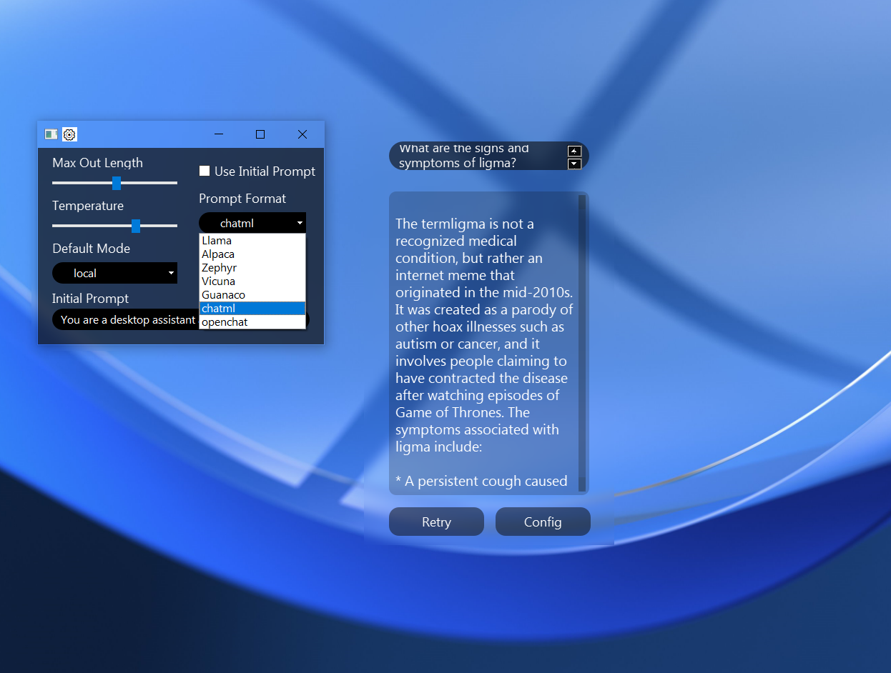
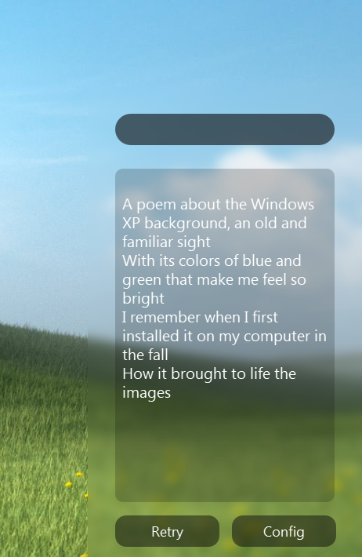

# WidgetAI
  A desktop UI for various LLM services

WidgetAI is a useless little app to let you talk to google's Palm2, chatGPT, or your own LLM through Kobold. I've packaged it using pyinstaller for windows, but executing the .py should maybe hopefully work on linux too.

To use the openai or palm API's enter your key/s in the config file. Palm2 is used at the moment but if Gemini is free it will replace Palm, if it's paid I'll add an option to select which model you want. To use a local model run koboldcpp and enable multiuser mode (optional). Enter http://localhost:5001/ in the config file. If you are running kobold on you PC and want to connect from a laptop, enter the local IP if you PC instead of localhost. If you want to run a remote server or connect to your PC from outside the network, atm use ngrok and expose port 5001 over http, and put the link in the config file. Koboldcpp just added a remote tunneling feature using cloudflare's services so I'll get that working soon.

## Commands
There are a few Minecraft format commands you can run in the UI.
- print version number: /ver
- enter openai key: /api {your key}
- print current openai model: /model
- change current openai model: /model {model name}
- change between openai, google palm, and local mode: /mode {new mode}
- print current mode: /mode
- print initial prompt: /initial
- use initial prompt: /initial {True/False}
- run a windows command: /cmd {command}
- clear output box: /clear or /cls
- restart app: /restart or /reboot
- quit app: /quit, /kill, /exit, or /cancel

## Customisation
The config file leaves two lines avalible for you to customise the input and output box via CSS. It's quite limited, just what PySide2 supports, but is still cool. You can also customize location on the wallpaper thorugh this file if you don't like the default

