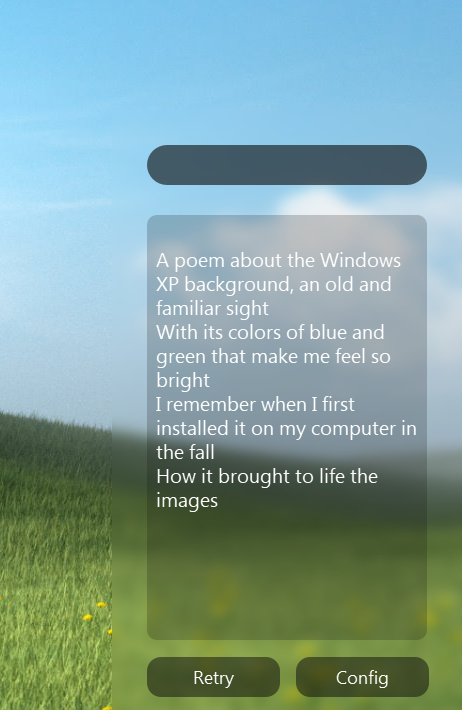

# WidgetAI
  A desktop UI for various LLM services

Built entirely in one python file (plus a config.txt), widgetAI is a useless little app to let you talk to google Palm, chatGPT, or your own LLM through Kobold. I've packaged it using pyinstaller for windows, but executing the .py should maybe hopefully work on linux too, if not please let me know. 

## Customisation
The config file leaves two lines avalible for you to customise the input and output box via CSS. It's quite limited, just what PySide2 supports, but is still cool. Right now the whole config and customization thing is a mess, orderd as added, but I promise to fix it in 1.0.5 (this is a lie).

